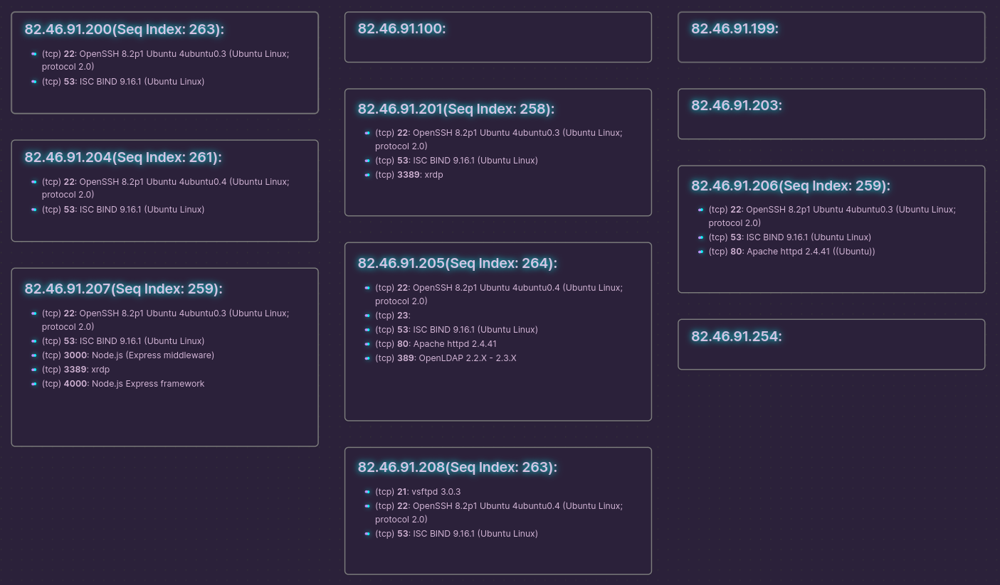

# nmap2obsidian
A simple python script for converting gnmap files to Obsidian canvases. Simply run nmap with the -oG (or -oA) argument to get a copy of the nmap scan in the greppable format (.gnmap). Give that gnmap file as input into this script and it'll spit out beautiful json representing that scan.

# Useage
`python3 nmap2canvas.py /path/to/scan.gnmap > NewObsidianFile.canvas`

This .canvas file can then be moved into your Obsidian vault and be used as a central hub for all your pentesting and networking notes!

# Example Output

# Future Work
This script was written in ~30 min while I was bored in class, so it has not been tested very well and doesn't support parsing out nmap script outputs or other advanced features. If you are using this and want some specific feature added open an issue and I should have time to fiddle with it more.

- [ ] Add script output
- [ ] Fix OS detection display
- [ ] Add switch to output to file instead of stdout

---
## I'm on <a href="https://www.buymeacoffee.com/djwolfe">buymeacoffee!</a>

  

